# Modular Chess – Instructions

**Version:** 1.0
**Date:** May 2026
**Author:** Aron Lange
**License:** CC BY-NC-SA 4.0

---

## Abstract

> *What if your pieces could not only move, but also transform?
> Modular Chess takes classic chess, breaks down each piece into its components,
> and gives you the power to redistribute material mid-game. Your bishop and your
> knight merge into a rook. Your queen splits into two rooks.
> Sounds like chaos? It is – but with rules.
> Welcome to chess for people who feel the classic game
> doesn't offer enough opportunities to make the wrong decision. ;D*

---

## Table of Contents

1. [Introduction & Overview](#1-introduction--overview)
2. [The Material System](#2-the-material-system)
3. [Starting Position](#3-starting-position)
4. [Movement Rules – The Classic Foundation](#4-movement-rules--the-classic-foundation)
5. [The New Rule: Transformation](#5-the-new-rule-transformation)
6. [Special Rules & Restrictions](#6-special-rules--restrictions)
7. [Notation](#7-notation)
8. [Strategy Tips](#8-strategy-tips)
9. [Material Overview](#9-material-overview)

---

## 1. Introduction & Overview

Modular Chess is a chess variant that builds upon the classic game of chess.
The board, starting position, and movement rules remain fully intact – only
one new move option is added: the **Transformation**.

In this process, piece values in the form of physical **module tiles** are
transferred between a player's own pieces. A knight can give its value to a pawn, two
minor pieces can merge into a rook, a queen can split into two rooks.

The special feature: The game pieces are designed so that every transformation is
also physically visible on the board. Every piece (except the king) consists of
a **base pawn** and up to four **module tiles** that are inserted into slots.

**Prerequisite:** Knowledge of classic chess rules.

---

## 2. The Material System

### 2.1 The Base Pawn

The foundation of every piece (except the king) is the **base pawn** – a cylindrical
piece body with four vertical slots arranged in a cross pattern around the central
axis. The slots are **not** connected in the center, so that the piece body
maintains its structural stability.

<!-- 📸 Figure 1: Base pawn with four slots – top view and side view -->
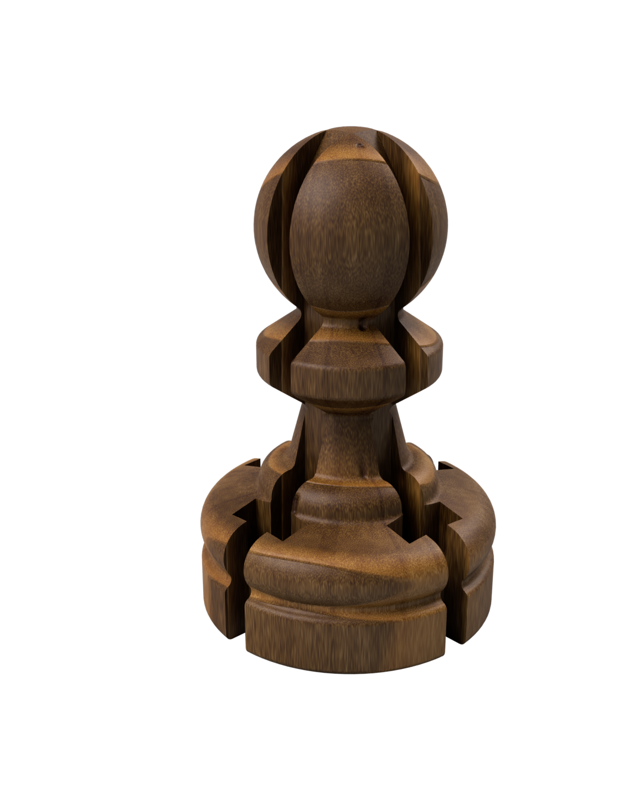

*Fig. 1: The base pawn.*

### 2.2 The Module Tiles

There are exactly two types of module tiles:

- **Knight module:** The silhouette shows the characteristic shape of a
  knight's head.
- **Bishop module:** The silhouette shows the characteristic mitre (pointed tip)
  of a bishop.

Both tiles are dimensioned to fit precisely into the slots of the base pawn.
Each module tile represents a **material value of 2 points**.

<!-- 📸 Figure 2: Knight module and bishop module – front and back -->
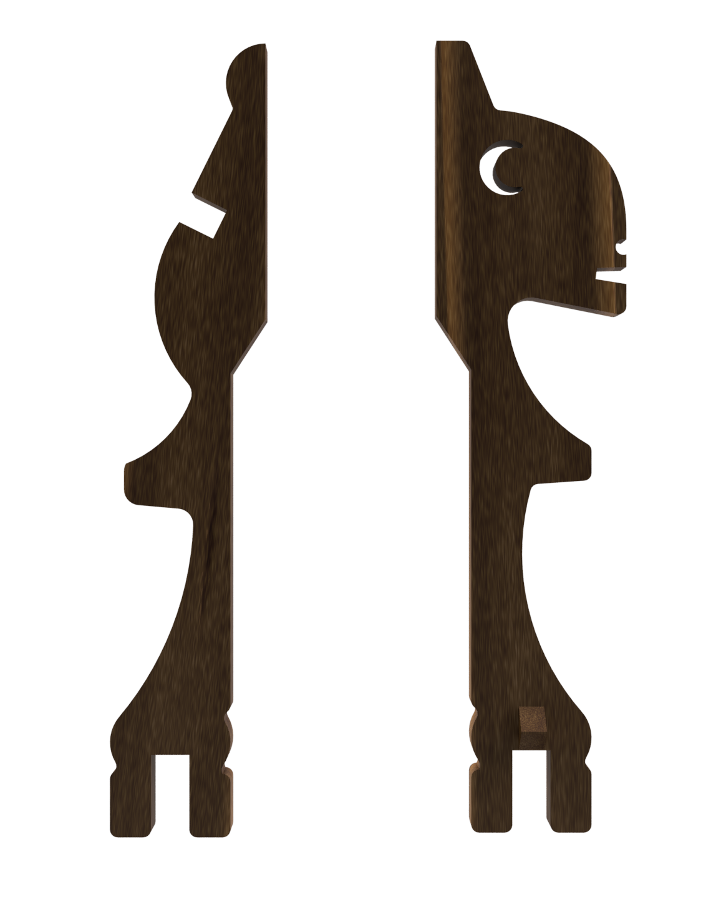

*Fig. 2: Left: Bishop module. Right: Knight module.*

### 2.3 Piece Assembly

By inserting the module tiles into the base pawn, all classic chess pieces
are created:

| Piece | Composition | Material Value | Assembly |
|-------|-------------|----------------|----------|
| **Pawn** | Base pawn (without modules) | 1 | – |
| **Knight** | Base pawn + 1 knight module | 3 (1+2) | Module in one slot, knight head visible facing outward |
| **Bishop** | Base pawn + 1 bishop module | 3 (1+2) | Module in one slot, mitre visible facing outward |
| **Rook** | Base pawn + 2 any modules | 5 (1+2+2) | Modules rotated 180° in opposite slots (starting position: 1N + 1B) |
| **Queen** | Base pawn + 4 any modules | 9 (1+4×2) | All 4 modules attached at the bottom as "stilts" (starting position: 2N + 2B) |
| **King** | Classic piece (not modular) | – | No modules |

#### The Knight

A knight module is inserted into one of the four slots with the silhouette
facing outward. The resulting piece is clearly identifiable by the recognizable
knight head.

<!-- 📸 Figure 3: Knight assembly -->
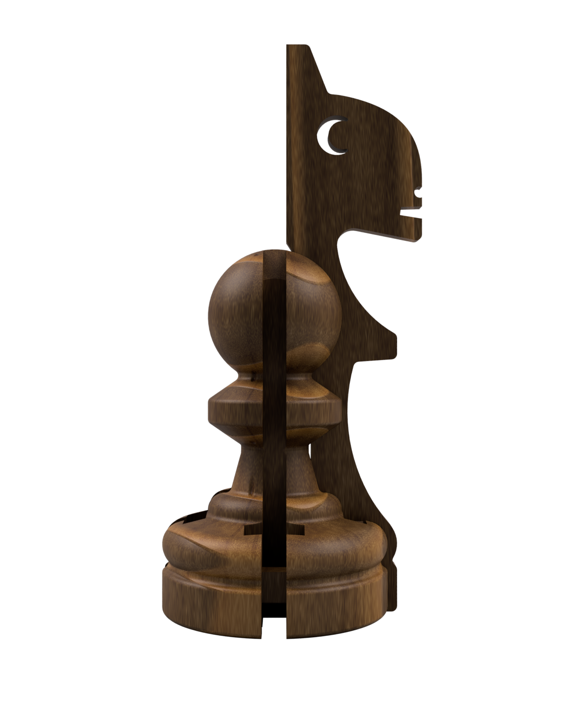

*Fig. 3: Assembly of a knight. The knight head is clearly recognizable as a
silhouette.*

#### The Bishop

Analogous to the knight, a bishop module is inserted into a slot with the
mitre tip facing outward.

<!-- 📸 Figure 4: Bishop assembly -->
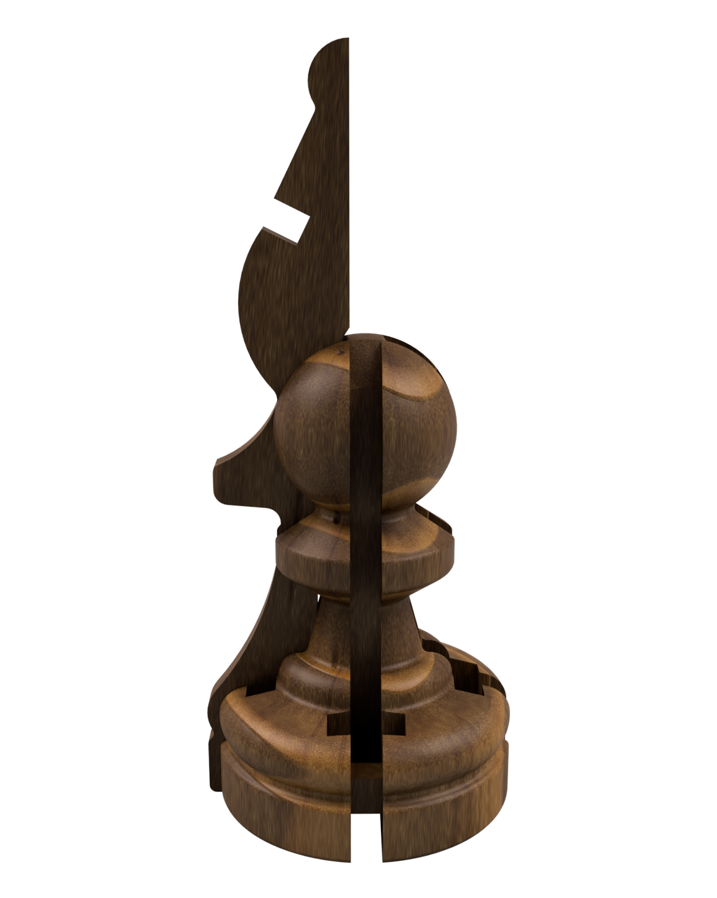

*Fig. 4: Assembly of a bishop. The bishop tip (mitre) is clearly recognizable
as a silhouette.*

#### The Rook

For the rook, a knight module and a bishop module are each inserted **rotated
180°** into two opposite slots. This causes the **back sides** of the tiles to
face outward. These are designed so that together they replicate the typical
battlement contour of a rook. At the same time, the piece is clearly
distinguished from the knight and bishop by the reversed insertion direction.
In the starting position, all rooks consist of one knight and one bishop module each.

<!-- 📸 Figure 5: Rook assembly – with detail view of the back sides -->
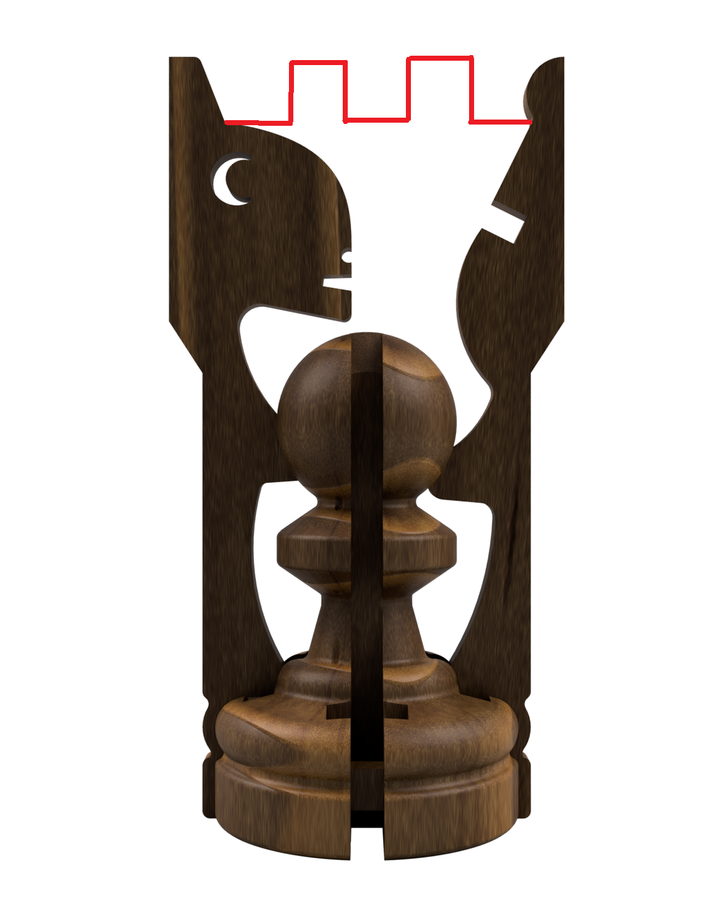

*Fig. 5: Assembly of a rook. The flipped modules form the rook silhouette
through their back sides. Detail: Knight head faces inward, battlement faces
outward.*

#### The Queen

The queen consists of all four module tiles, which are attached to the
**underside** of the base pawn. The modules are attached in a rotated position
and serve as "stilts," causing the queen to stand significantly taller than
all other pieces and making it immediately recognizable. The arrangement of
the modules on the underside is arbitrary. In the starting position, the queens
each consist of two knight and two bishop modules.

<!-- 📸 Figure 6: Queen assembly -->
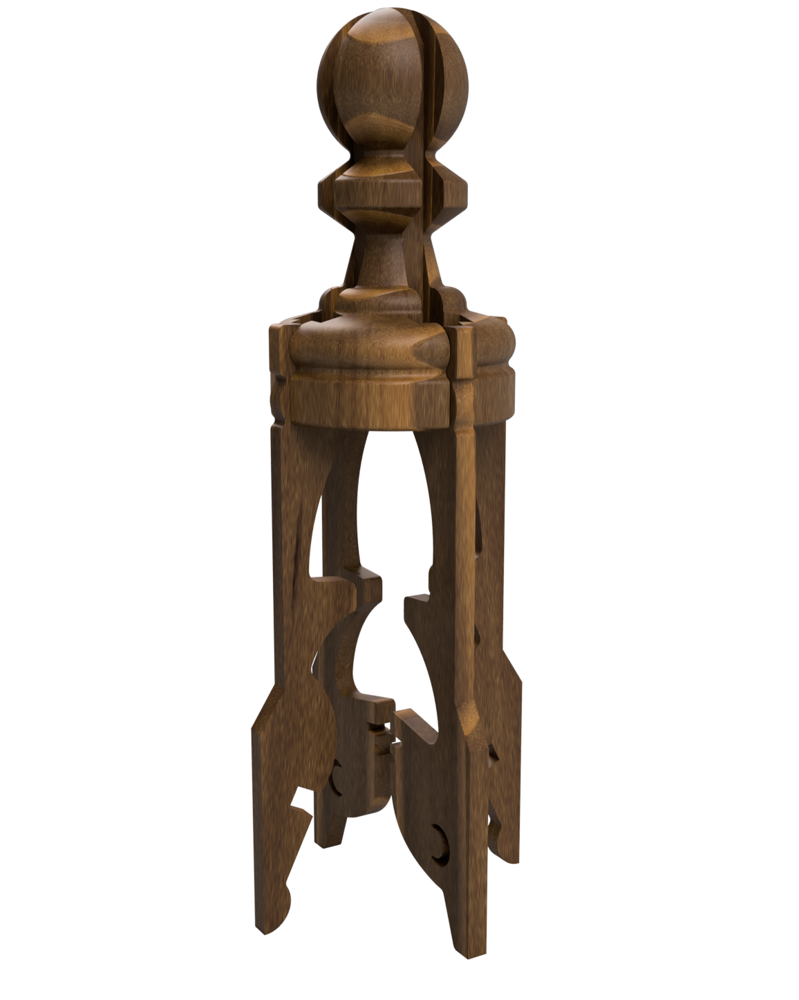

*Fig. 6: Assembly of a queen. The four modules as "stilts" on the underside
elevate the piece clearly above the board.*

#### The King

The king is the only non-modular piece. It retains its classic form and does
not participate in the transformation system.

---

<!-- 📸 Figure 7: All pieces side by side -->
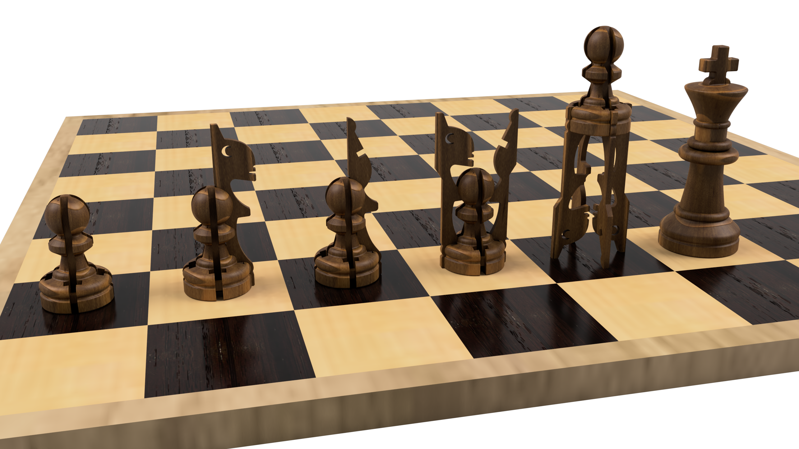

*Fig. 7: All piece types in direct comparison (left to right): Pawn, Knight,
Bishop, Rook, Queen, King.*

---

## 3. Starting Position

The starting position is **identical to classic chess**. All pieces stand on the
board in their fully assembled form.

<!-- 📸 Figure 8: Starting position -->
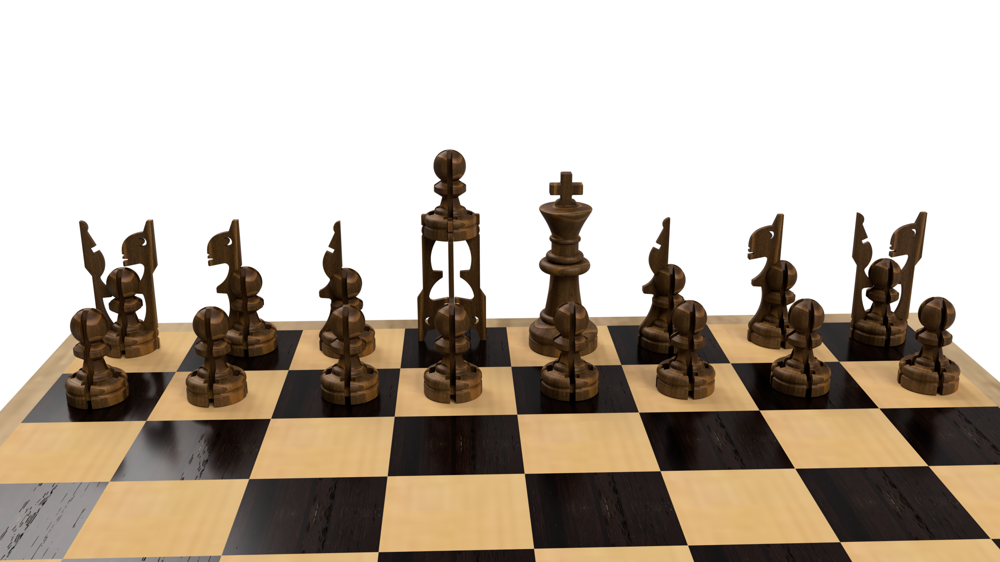

*Fig. 8: Starting position. Identical to classic chess.*

---

## 4. Movement Rules – The Classic Foundation

All pieces move and capture **exactly as in classic chess**:

- The **pawn** moves one square forward (two from the starting square), captures diagonally.
- The **knight** moves in an L-shaped pattern and jumps over other pieces.
- The **bishop** moves diagonally any number of squares.
- The **rook** moves horizontally and vertically any number of squares.
- The **queen** moves horizontally, vertically, and diagonally any number of squares.
- The **king** moves one square in any direction.

**Check**, **checkmate**, **stalemate**, **en passant**, and **castling** apply unchanged
(with the restrictions mentioned in Section 6).

A completely regular chess game is possible at any time in this variant.

---

## 5. The New Rule: Transformation

### 5.1 Basic Principle

When a player is on move, they have an additional option besides a normal move:
They may **transfer module tiles from one of their own pieces to another of their
own pieces**. This is called a **Transformation** and replaces the normal move for
that turn – so either a normal move OR a transformation is allowed.

### 5.2 Conditions

A transformation is subject to the following conditions:

1. **Range:** The giving piece must be able to **reach** the square of the
   receiving piece with its current movement pattern – as if it were trying to
   capture an opponent's piece on that square. All normal movement rules apply
   (e.g., a bishop may not move through other pieces).

2. **One target square:** Per transformation, only **one single target square**
   may be selected. Modules may not be distributed to multiple squares in one
   move.

3. **Valid results:** On both affected squares (source and target square),
   **valid pieces** must result after the transformation – pieces that exist in
   classic chess (pawn, knight, bishop, rook, or queen).

4. **Free choice of modules:** The player decides which and how many modules
   are transferred – as long as conditions 2 and 3 are met.

5. **King excluded:** The king can neither give nor receive modules.

### 5.3 Examples

#### Example 1: Fusion (Bishop + Knight → Rook)

A white **bishop** stands on a2, a white **knight** on b3.
The bishop can reach the square b3 diagonally.

**Transformation:** The bishop module is transferred from a2 to b3.

**Result:**
- Square a2: Base pawn (without modules) → **Pawn**
- Square b3: Base pawn + knight module + bishop module → **Rook**

<!-- 📸 Figure 9: Fusion example -->
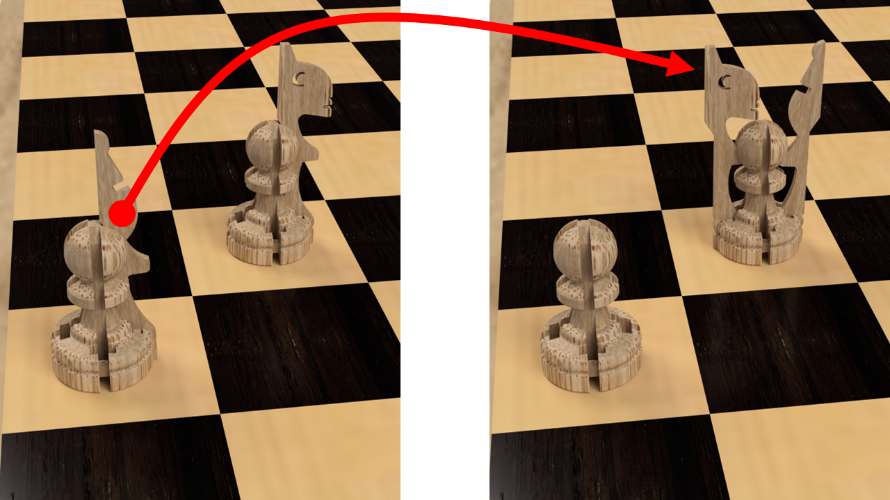

*Fig. 9: Transformation – Fusion. The bishop on a2 transfers its module to the
knight on b3. Result: Pawn on a2, Rook on b3.*

#### Example 2: Split (Queen → Rook + Rook)

A white **queen** stands on d1, a white **pawn** on e2.
The queen can reach the square e2 diagonally.

**Transformation:** Two modules are transferred from d1 to e2.

**Result (Variant A – mixed rooks):**
- Square d1: Base pawn + 1 knight module + 1 bishop module → **Rook**
- Square e2: Base pawn + 1 knight module + 1 bishop module → **Rook**

**Result (Variant B – same-type rooks):**
- Square d1: Base pawn + 2 knight modules → **Rook**
- Square e2: Base pawn + 2 bishop modules → **Rook**

The player freely chooses which modules are transferred. In terms of game
mechanics, both variants are initially identical (both pieces are rooks). However,
this changes as soon as the rooks are split again and different minor pieces remain.

<!-- 📸 Figure 10: Split example -->
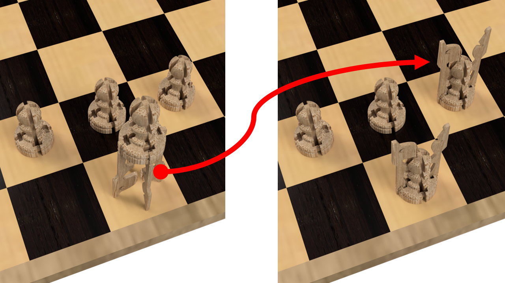

*Fig. 10: Transformation – Split. The queen on d1 transfers two modules to the
pawn on e2. Result: Two rooks.*

#### Counter-example: Multiple target squares (❌ forbidden)

A white queen stands on d1, white pawns on c2, d2, and e2.
The queen could reach all three squares.

**NOT allowed:** Distributing modules to c2 AND e2 simultaneously.
Only **one** target square may be chosen per move.

<!-- 📸 Figure 11: Counter-example -->
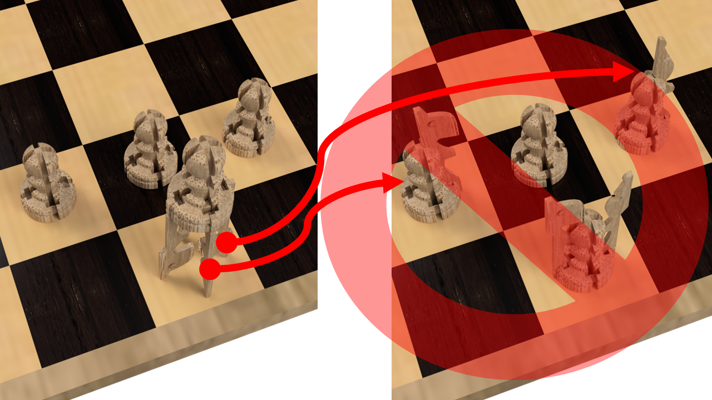

*Fig. 11: Forbidden – Modules may not be distributed to multiple squares in one
move.*

---

## 6. Special Rules & Restrictions

### 6.1 Castling

Castling is only allowed with **original rooks** that have **not been involved in
a transformation** since the start of the game – neither as a giving nor as a
receiving piece. As soon as a rook gives or receives modules, it permanently
loses the right to castle.

### 6.2 No Pawns on the Back Rank

A transformation may **not create a pawn on either of the two back ranks**
(rank 1 or rank 8). A transformation that would create a pawn on the back rank
is not allowed.

*Example:* A rook on a1 may not give all its modules to a piece on a2, as this
would create a pawn on the player's own back rank on a1.

<!-- 📸 Figure 12: Counter-example back rank -->
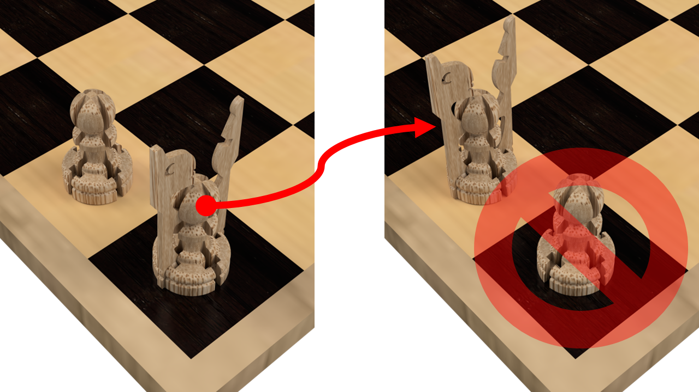

*Fig. 12: Forbidden – The transformation would create a pawn on the back rank
(a1).*

### 6.3 Restricted Pawn Promotion

When a pawn reaches the opponent's back rank, it may be promoted to **at most a
rook** (= receives at most 2 module tiles). Promotion to a queen is **not**
allowed.

**Reasoning:** Without this restriction, the following cycle would be possible:
Pawn reaches back rank → promotion to queen → one step back → transfer modules
to another pawn → move to back rank again → promote again. This would lead to
rapid, uncontrollable material multiplication.

**Note:** Even with the restriction to at most a rook upon promotion, long-term
material multiplication through this cycle remains theoretically possible
(promotion to rook → retreat → transfer modules → promote again). However, the
cycle is significantly weakened, as only 2 modules instead of 4 are gained per
promotion, and each cycle costs several moves – tempo that the opponent can use.

### 6.4 En Passant

The en passant rule applies exclusively to **regular pawn moves**. A pawn that
is created through a transformation on a square (e.g., because a piece gives
away all its modules) may **not** be captured en passant on the following move –
even if it stands on a square that would correspond to a double step.

---

## 7. Notation

### 7.1 Basic Principle

Modular Chess uses the **algebraic notation** of classic chess as its basis.
For normal moves, nothing changes. For transformations, an extended notation
is introduced.

### 7.2 Normal Moves

Normal moves are notated as usual:

| Notation | Meaning |
|----------|---------|
| `e4` | Pawn moves to e4 |
| `Nf3` | Knight moves to f3 |
| `Bxc6` | Bishop captures on c6 |
| `O-O` | Kingside castling |
| `O-O-O` | Queenside castling |
| `e8=R` | Pawn promoted to rook on e8 |

### 7.3 Transformations

Transformations are notated with the following scheme:
```
[Source square]>[Target square]=[Result target square]
```

The **result on the source square** is implied (total material minus transferred
modules).

#### Piece Symbols for Notation

| Symbol | Piece |
|--------|-------|
| `N` | Knight |
| `B` | Bishop |
| `R` | Rook |
| `Q` | Queen |

#### Examples

| Position | Transformation | Notation | Result |
|----------|---------------|----------|--------|
| Bishop a2, Knight b3 | Bishop module → b3 | `a2>b3=R` | Pawn a2, Rook b3 |
| Knight f3, Pawn d2 | Knight module → d2 | `f3>d2=N` | Pawn f3, Knight d2 |
| Rook a3, Rook d3 | 2 mixed modules → d3 | `a3>d3=Q` | Pawn a3, Queen d3 |
| Rook a1, Pawn a2 | Knight module → a2 | `a1>a2=N` | Bishop a1, Knight a2 |

#### Mandatory Specification for Ambiguous Transformations

When a queen is split, the transferred modules to the target square **must** be
specified. This is game-relevant, as rooks/queens can be split again in later
moves, and the resulting minor pieces depend on the module composition.

- `(NN)` = two knight modules
- `(BB)` = two bishop modules
- `(NB)` = one knight module + one bishop module

The composition of the **source square rook** is implicitly derived from the
remaining modules.

For mixed rooks `R(NB)`, a similar case can occur when a module is given to a
minor piece. In this case, the transferred module must also be listed in
parentheses.

**Example:**

| Position | Notation | Result |
|----------|----------|--------|
| Queen d1(NNBB), Pawn e2 | `d1>e2=R(NN)` | Rook d1 (BB), Rook e2 (NN) |
| Queen d1(NNBB), Pawn e2 | `d1>e2=R(NB)` | Rook d1 (NB), Rook e2 (NB) |
| Queen d1(NNBB), Pawn e2 | `d1>e2=R(BB)` | Rook d1 (NN), Rook e2 (BB) |
| Queen b1(NNBB), Rook a1(NB) | `b1>a1=Q(BB)` | Queen b1 (NBBB), Rook d1 (NN) |
| Rook a1(NB), Bishop b1 | `a1>b1=R(B)` | Knight a1, Rook b1 (BB) |

**Note:** For all other transformations, the module composition is unambiguous
and does not need to be specified.

### 7.4 Complete Notation Example
```
e4 e5
Nf3 Nc6
Bc4 Nf6
f3>d2=N ... (Knight f3 transfers knight module to pawn d2 → Pawn f3, Knight d2)
```

**Note:** In such a case, the pieces can also be swapped instead of re-inserting
the module tile.

---

## 8. Strategy Tips

- **Transformation costs tempo:** Every transformation replaces a normal move.
  Consider carefully whether the positional advantage justifies the tempo loss.
- **Preserve flexibility:** Pieces near your own pawns can split at any time –
  this creates tactical threats.
- **Split rooks:** Two minor pieces control more squares than one rook. In open
  positions, a split can enable powerful double attacks.
- **Prepare fusions:** Two minor pieces that can "see" each other can merge into
  a rook on the next move – a hidden threat.
- **Mind castling rights:** Transformations involving the starting rooks cost
  castling rights. Early castling secures this option.

---

## 9. Material Overview

### Per Color (White or Black):

| Component | Quantity |
|-----------|----------|
| King (classic) | 1 |
| Base pawns (with 4 slots) | 15 |
| Knight modules | 6 |
| Bishop modules | 6 |

### Total:

| Component | Quantity |
|-----------|----------|
| Kings | 2 |
| Base pawns | 30 |
| Knight modules | 12 |
| Bishop modules | 12 |
| Chessboard 8×8 (square size: 4–6 cm) | 1 |

**Total number of modules:** 24
**Total number of piece bodies:** 32 (same as in classic chess)

## 3D Printing

The pieces for Modular Chess can be produced with a standard 3D printer.
The print-ready files (STL) are available here:

📦 **[Modular Chess on MakerWorld](https://makerworld.com/de/models/YOUR-LINK)**

---

## Changelog

| Version | Date | Changes |
|---------|------|---------|
| 1.0 | May 2026 | Initial release |

---

*© 2026 Aron Lange. This work is licensed under
[CC BY-NC-SA 4.0](https://creativecommons.org/licenses/by-nc-sa/4.0/).*
